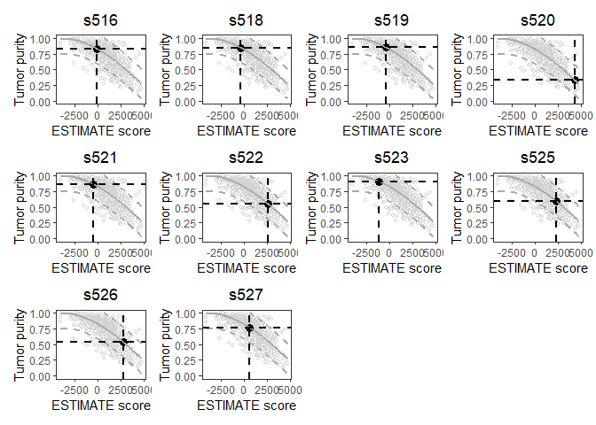

<!-- README.md is generated from README.Rmd. Please edit that file -->

# ESTIMATE

<!-- badges: start -->
<!-- badges: end -->

The goal of ESTIMATE is to predict tumor purity, and the presence of
stromal/immune cells in tumor tissues using gene expression data.

## Installation

You can install the released version of ESTIMATE from
[github](https://CRAN.R-project.org) with:

``` r
install.packages("devtools")
devtools::install_github("Moonerss/ESTIMATE")
```

## Example

use the function to do the ESTIMATE analysis:

``` r
library(ESTIMATE)

## read expression profile
file <- system.file("extdata", "sample_input.txt", package="ESTIMATE")
expression <- read.table(file, header = TRUE, stringsAsFactors = FALSE)

## Intersect input data with 10,412 common genes
merged_expr <- filterCommonGenes(expr = data.matrix(expression), id = "GeneSymbol")
#> [1] "Merged dataset includes 10412 genes (0 mismatched)."

## Calculation of stromal, immune, and ESTIMATE scores
scores <- estimateScore(merged_expr, platform = "affymetrix")
#> [1] "1 gene set: StromalSignature  overlap= 141"
#> [1] "2 gene set: ImmuneSignature  overlap= 141"
```

``` r
head(scores)
#>                       s516         s518         s519         s520         s521
#> StromalScore  -281.8148664 -426.1469233  -57.1497652 1938.8237862 -671.6471021
#> ImmuneScore    171.5411403  105.3889654 -365.2373655 2339.0706591  147.6183341
#> ESTIMATEScore -110.2737261 -320.7579579 -422.3871308 4277.8944454 -524.0287681
#> TumorPurity      0.8316075    0.8483668    0.8561698    0.3314725    0.8637832
#>                      s522          s523         s525         s526         s527
#> StromalScore  1458.138373  -268.8921569  973.4228898  552.6416143 -709.3356782
#> ImmuneScore   1176.815927  -928.4953217 1320.0869341 2162.4612378 1312.8415811
#> ESTIMATEScore 2634.954300 -1197.3874786 2293.5098239 2715.1028521  603.5059029
#> TumorPurity      0.547211     0.9092887    0.5884565    0.5373262    0.7689656
```

plot the tumor purity scatterplots:

``` r
pic <- plotPurity(scores)
#> Plotting tumor purity based on ESTIMATE score
pic
```


